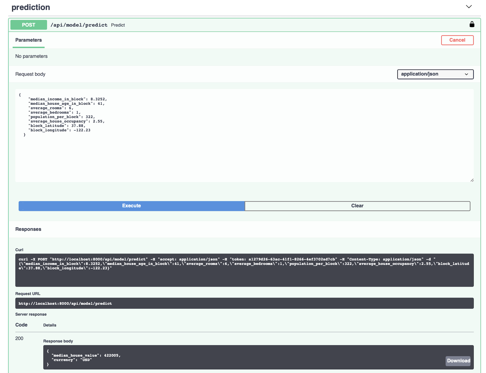

# FastAPI Cluster app

## Installation
Install the required packages in your local environment (ideally virtualenv, conda, etc.).
```bash
pip install -r requirements
```

Ignore for now. Env vars are store in the Docker file for now. Will create .env file in the future
<!-- ## Setup
1. Duplicate the `.env.example` file and rename it to `.env`


2. In the `.env` file configure the `API_KEY` entry. The key is used for authenticating our API. <br>
   A sample API key can be generated using Python REPL:
```python
import uuid
print(str(uuid.uuid4())) -->
<!-- ``` -->


## Run It

1. Start your  app with:
```
docker-compose build
```

```
docker-compose up
```

## Test API
1. Go to [http://localhost:8000/docs](http://localhost:8000/docs).

2. Click `Authorize` and enter the API key as created in the Setup step.


3. You can use the sample payload from the `docs/sample_payload.json` file when trying out the house price prediction model using the API.
   

<!-- ## Run Tests

If you're not using `tox`, please install with:
```bash
pip install tox
```

Run your tests with:
```bash
tox
```

This runs tests and coverage for Python 3.6 and Flake8, Autopep8, Bandit. -->
